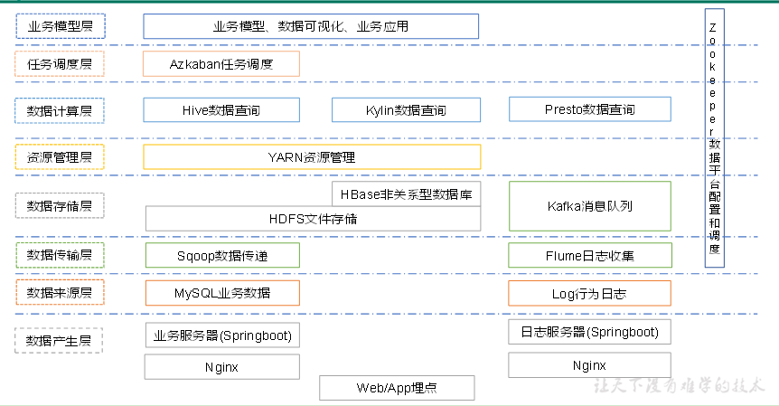
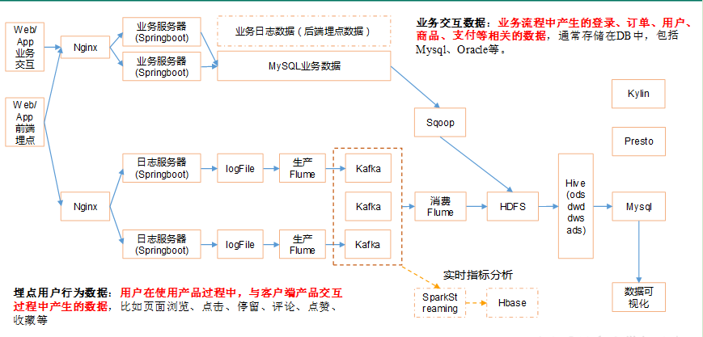
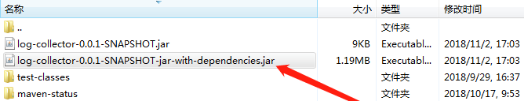
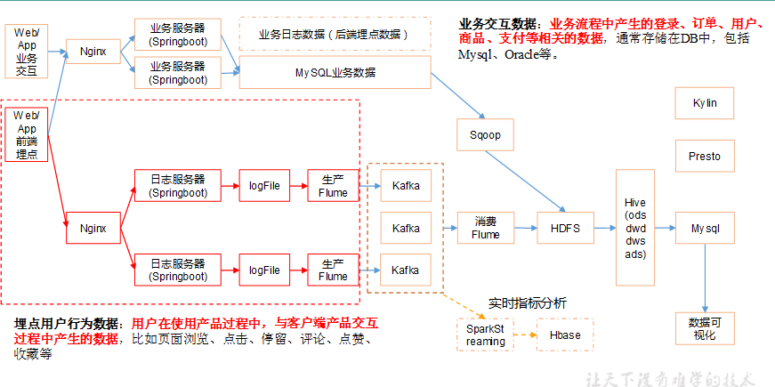
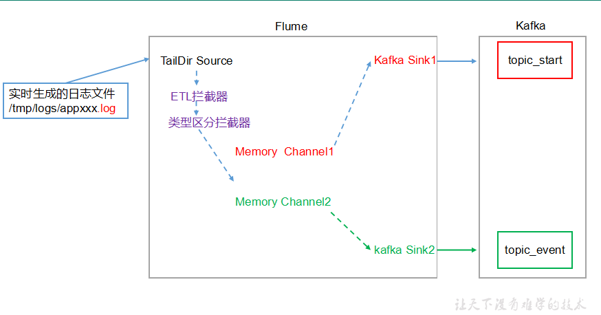
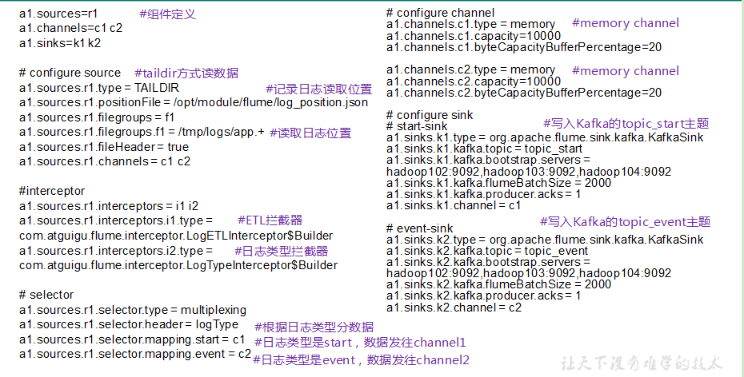
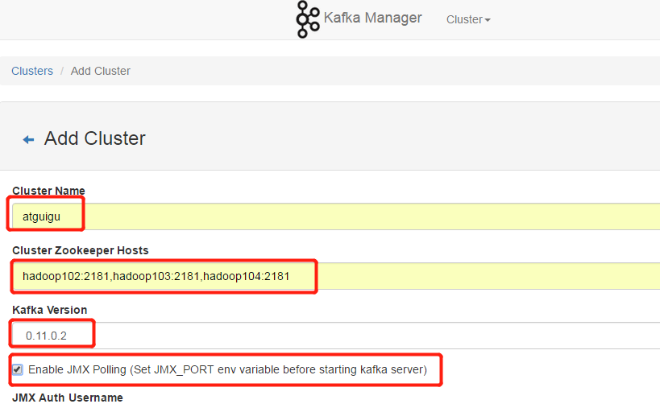

# 搭建数仓

##1，项目框架：

###1,1数仓的技术选型：

|       -        | -      | -      | -         | -     | -     |
| :------------: | ------ | ------ | --------- | ----- | ----- |
| 数据采集传输： | Flume  | Kafka  | Longstash | DataX | Sqoop |
|   数据存储：   | Hive   | MySql  | HDFS      | HBase | S3    |
|   数据计算：   | Spark  | Hive   | Tez       | Flink | Storm |
|   数据查询：   | Presto | Impala | Kylin     |       |       |

###1,2系统架构图：




### 1,3系统数据流程设计：



###1.4框架版本选型：

| 产品          | 版本     |
| ------------- | -------- |
| Hadoop        | 2.7.2    |
| Flume         | 1.7.0    |
| Kafka         | 0.11.0.2 |
| Kafka Manager | 1.3.3.22 |
| Hive          | 1.2.1    |
| Sqoop         | 1.4.6    |
| MySQL         | 5.6.24   |
| Azkaban       | 2.5.0    |
| Java          | 1.8      |
| Zookeeper     | 3.4.10   |
| Presto        | 0.189    |

### 1.5集群资源规划设计：

|                    | 服务器hadoop102  | 服务器hadoop103            | 服务器hadoop104           |
| ------------------ | ---------------- | -------------------------- | ------------------------- |
| HDFS               | NameNodeDataNode | DataNode                   | DataNodeSecondaryNameNode |
| Yarn               | NodeManager      | ResourcemanagerNodeManager | NodeManager               |
| Zookeeper          | Zookeeper        | Zookeeper                  | Zookeeper                 |
| Flume(采集日志)    | Flume            | Flume                      |                           |
| Kafka              | Kafka            | Kafka                      | Kafka                     |
| Flume（消费Kafka） |                  |                            | Flume                     |
| Hive               | Hive             |                            |                           |
| MySQL              | MySQL            |                            |                           |
| Presto             | Presto           | Presto                     | Presto                    |

## 2，搭建Hadoop集群：

### 2.1hadoop架构：

|      | 服务器hadoop102  | 服务器hadoop103            | 服务器hadoop104           |
| ---- | ---------------- | -------------------------- | ------------------------- |
| HDFS | NameNodeDataNode | DataNode                   | DataNodeSecondaryNameNode |
| Yarn | NodeManager      | ResourcemanagerNodeManager | NodeManager               |

###2,2克隆三台虚拟机：

1.	克隆虚拟机

> 完整克隆和链接克隆度可以：建议完整克隆，如果硬盘空间有限，可以链接克隆。

2.	修改克隆虚拟机的静态IP

> 编辑vim /etc/sysconfig/network-scripts/ifcfg-eth0
>
> 改成
>
> DEVICE=eth0
> TYPE=Ethernet
> ONBOOT=yes
> ==BOOTPROTO=static==
> NAME="eth0"
> ==IPADDR=192.168.1.102==
> PREFIX=24
> ==GATEWAY=192.168.1.2==
> DNS1=192.168.1.2

3. **删除一个网卡(eth1):**

> 编辑vim /etc/udev/rules.d/70-persistent-net.rules
>
> 先把NAME="eth0" 的删除
>
>  NAME="eth1" 改成NAME="eth0" 

4. **配置 vim /etc/hosts:**

   ==注意：window系统也需要配置这个hosts文件:位置 C:\Windows\System32\drivers\etc==

```shell
192.168.1.100   hadoop100
192.168.1.101   hadoop101
192.168.1.102   hadoop102
192.168.1.103   hadoop103
192.168.1.104   hadoop104
192.168.1.105   hadoop105
192.168.1.106   hadoop106
192.168.1.107   hadoop107
192.168.1.108   hadoop108
192.168.1.109   hadoop109
```

5. **修改主机名**

> 编辑vim /etc/sysconfig/network
>
> 改HOSTNAME=那一行

6. **关闭防火墙**

> sudo service iptables stop
>
> sudo chkconfig iptables off

7. **创建atguigu用户**

> useradd atguigu
>
> passwd atguigu

8. **配置atguigu用户具有root权限**

> vim /etc/sudoers
>
> ​    在root    ALL=(ALL)       ALL
>     添加atguigu    ALL=(ALL)       NOPASSWD:ALL
>    ==保存时wq!强制保存==

9. **在/opt目录下创建module、software文件夹，并修改权限为atguigu所有。**

> mkdir /opt/module /opt/software
> chown atguigu:atguigu /opt/module /opt/software

7. **关机，快照**

###2.3安装JDK:

1. **卸载现有JDK**

   ```shell
   # 查询是否安装过jdk
   [atguigu@hadoop101 opt]$ rpm -qa | grep java
   # 卸载jdk
   [atguigu@hadoop101 opt]$ sudo rpm -e 软件包
   ```

	.	然后把jdk安装包放到/opt/software目录下，然后解压到moudle目录下。

   ```shell
   [atguigu@hadoop101 software]$ tar -zxvf jdk-8u144-linux-x64.tar.gz -C /opt/module
   ```

	.	打开/etc/profile文件

   ```shell
   [atguigu@hadoop101 software]$ sudo vim /etc/profile
   ```

	.	在profile文件末尾添加JDK路径

   ```shell
   #JAVA_HOME
   export JAVA_HOME=/opt/module/jdk1.8.0_144
   export PATH=$PATH:$JAVA_HOME/bin
   ```

   ​

	.	让修改后的文件生效

   ```shell
   [atguigu@hadoop101 jdk1.8.0_144]$ source /etc/profile
   ```

### 2.4配置SSH免密登录:

1. **生成公钥和私钥(~/.ssh目录)**

   ```shell
   [atguigu@hadoop102 .ssh]$ ssh-keygen -t rsa
   ```

   >  然后敲（三个回车），就会生成两个文件id_rsa（私钥）、id_rsa.pub（公钥）p>

2. **将公钥拷贝到要免密登录的目标机器上**

   ```shell
   [atguigu@hadoop102 .ssh]$ ssh-copy-id hadoop102
   [atguigu@hadoop102 .ssh]$ ssh-copy-id hadoop103
   [atguigu@hadoop102 .ssh]$ ssh-copy-id hadoop104
   ```

   ​

   ==注意：==

   ==还需要在hadoop102上采用root账号，配置一下无密登录到hadoop102、hadoop103、hadoop104；==

   ==还需要在hadoop103上采用atguigu账号配置一下无密登录到hadoop102、hadoop103、hadoop104服务器上==。

   ​

### 2.5安装hadoop:

1. **然后把hadoop安装包放到/opt/software目录下，然后解压到moudle目录下。**

   ```shell
   [atguigu@hadoop102 software]$ tar -zxvf hadoop-2.7.2.tar.gz -C /opt/module/
   ```

2. **将Hadoop添加到环境变量/etc/profile中**

   ```shell
   ##HADOOP_HOME
   export HADOOP_HOME=/opt/module/hadoop-2.7.2
   export PATH=$PATH:$HADOOP_HOME/bin
   export PATH=$PATH:$HADOOP_HOME/sbin
   ```

3. **让修改后的文件生效**

   ```shell
   [atguigu@hadoop102 hadoop-2.7.2]$ source /etc/profile
   ```

4. **测试是否安装成功t**

   ```shell
   [atguigu@hadoop102 hadoop-2.7.2]$ hadoop version
   Hadoop 2.7.2
   ```

5. **编写分发脚本：xsync**

   > 在/home/atguigu目录下创建bin目录，并在bin目录下xsync创建文件，文件内容如下：

   ```shell
   #!/bin/bash
   #1 获取输入参数个数，如果没有参数，直接退出
   pcount=$#
   if((pcount==0)); then
   echo no args;
   exit;
   fi

   #2 获取文件名称
   p1=$1
   fname=`basename $p1`
   echo fname=$fname

   #3 获取上级目录到绝对路径
   pdir=`cd -P $(dirname $p1); pwd`
   echo pdir=$pdir

   #4 获取当前用户名称
   user=`whoami`

   #5 循环
   for((host=103; host<105; host++)); do
           echo ------------------- hadoop$host --------------
           rsync -rvl $pdir/$fname $user@hadoop$host:$pdir
   done
   ```

6. **修改脚本 xsync 具有执行权限，并且拷贝到/bin目录下**

   ```shell
   [atguigu@hadoop102 bin]$ chmod 777 xsync
   [atguigu@hadoop102 bin]$ sudo cp ~/bin/xsync /bin
   ```

### 2.6配置hadoop集群:

####2.6.1：4个site文件，3个env文件，1个slaves文件

+ **core-site.xml**

```xml
<!-- 指定HDFS中NameNode的地址 -->
<property>
		<name>fs.defaultFS</name>
      <value>hdfs://hadoop102:9000</value>
</property>

<!-- 指定Hadoop运行时产生文件的存储目录 -->
<property>
		<name>hadoop.tmp.dir</name>
		<value>/opt/module/hadoop-2.7.2/data/tmp</value>
</property>
```

+ **hadoop-env.sh**

```shell
export JAVA_HOME=/opt/module/jdk1.8.0_144
```

+ **hdfs-site.xml**

```xml
<!-- 指定副本数 -->
<property>
		<name>dfs.replication</name>
		<value>3</value>
</property>

<!-- 指定Hadoop辅助名称节点主机配置 -->
<property>
      <name>dfs.namenode.secondary.http-address</name>
      <value>hadoop104:50090</value>
</property>
```

+ **yarn-env.sh**

```shell
export JAVA_HOME=/opt/module/jdk1.8.0_144
```

+ **yarn-site.xml**

```xml
<!-- Reducer获取数据的方式 -->
<property>
		<name>yarn.nodemanager.aux-services</name>
		<value>mapreduce_shuffle</value>
</property>

<!-- 指定YARN的ResourceManager的地址 -->
<property>
		<name>yarn.resourcemanager.hostname</name>
		<value>hadoop103</value>
</property>
```

+ **mapred-env.sh**

```shell
export JAVA_HOME=/opt/module/jdk1.8.0_144
```

+ **mapred-site.xml**

```xml
<!-- 指定MR运行在Yarn上 -->
<property>
		<name>mapreduce.framework.name</name>
		<value>yarn</value>
</property>
```

+ **slaves(注意不要有空格和空行)**

```shell
hadoop102
hadoop103
hadoop104
```

#### 2.6.2：分发文件到其他节点

```shell
[atguigu@hadoop102 hadoop]$ xsync /opt/module/hadoop-2.7.2/
```

####2.6.3：如果集群是第一次启动，需要格式化**NameNode**

```shell
[atguigu@hadoop102 hadoop-2.7.2]$ hadoop namenode -format
```


### 2.7 添加LZO支持包:

1. **将编译好后的hadoop-lzo-0.4.20.jar 放入hadoop-2.7.2/share/hadoop/common/**

2. **同步hadoop-lzo-0.4.20.jar到hadoop103、hadoop104**

3. **core-site.xml增加配置支持LZO压缩**

   ```xml
   <?xml version="1.0" encoding="UTF-8"?>
   <?xml-stylesheet type="text/xsl" href="configuration.xsl"?>

   <configuration>

   <property>
   <name>io.compression.codecs</name>
   <value>
   org.apache.hadoop.io.compress.GzipCodec,
   org.apache.hadoop.io.compress.DefaultCodec,
   org.apache.hadoop.io.compress.BZip2Codec,
   org.apache.hadoop.io.compress.SnappyCodec,
   com.hadoop.compression.lzo.LzoCodec,
   com.hadoop.compression.lzo.LzopCodec
   </value>
   </property>

   <property>
       <name>io.compression.codec.lzo.class</name>
       <value>com.hadoop.compression.lzo.LzoCodec</value>
   </property>

   </configuration>
   ```

4. **同步core-site.xml到hadoop103、hadoop104**

###2.8 **启动集群**:

```shell
[atguigu@hadoop102 hadoop-2.7.2]$ sbin/start-dfs.sh
[atguigu@hadoop103 hadoop-2.7.2]$ sbin/start-yarn.sh
```


##3，搭建Zookeeper:

###3.1 zk集群规划：

|           | 服务器hadoop102 | 服务器hadoop103 | 服务器hadoop104 |
| --------- | --------------- | --------------- | --------------- |
| Zookeeper | Zookeeper       | Zookeeper       | Zookeeper       |

###3.2 zk解压配置：

1. 解压Zookeeper安装包到/opt/module/目录下

   ```shell
   [atguigu@hadoop102 software]$ tar -zxvf zookeeper-3.4.10.tar.gz -C /opt/module/
   ```

2. 同步/opt/module/zookeeper-3.4.10目录内容到hadoop103、hadoop104c

   ```shell
   [atguigu@hadoop102 module]$ xsync zookeeper-3.4.10/
   ```

3. 配置服务器编号myid

   （1）在/opt/module/zookeeper-3.4.10/这个目录下创建zkData

   ```shell
   [atguigu@hadoop102 zookeeper-3.4.10]$ mkdir -p zkData
   ```

   （2）在/opt/module/zookeeper-3.4.10/zkData目录下创建一个myid的文件

   ```shell
   [atguigu@hadoop102 zkData]$ touch myid
   ```

   > 添加myid文件，注意一定要在linux里面创建，在notepad++里面很可能乱码

   （3）编辑myid文件

   ```
   [atguigu@hadoop102 zkData]$ vi myid
   ```

   > 在文件中添加与server对应的编号：2

   （4）拷贝配置好的zookeeper到其他机器上

   ```
   [atguigu@hadoop102 zkData]$ xsync myid
   ```

   并分别在hadoop102、hadoop103上修改myid文件中内容为3、4

4. 配置zoo.cfg文件

   （1）重命名/opt/module/zookeeper-3.4.10/conf这个目录下的zoo_sample.cfg为zoo.cfg

   ```shell
   [atguigu@hadoop102 conf]$ mv zoo_sample.cfg zoo.cfg
   ```

   （2）打开zoo.cfg文件

   ```shell
   [atguigu@hadoop102 conf]$ vim zoo.cfg
   ```

   ==修改数据存储路径配置==

   ```shell
   dataDir=/opt/module/zookeeper-3.4.10/zkData
   ```

   增加如下配置

   ```shell
   #######################cluster##########################
   server.2=hadoop102:2888:3888
   server.3=hadoop103:2888:3888
   server.4=hadoop104:2888:3888

   ```

   （3）同步zoo.cfg配置文件

   ```shell
   [atguigu@hadoop102 conf]$ xsync zoo.cfg
   ```

### 3.3 **ZK**集群启动停止脚本

1. 在hadoop102的/home/atguigu/bin目录下创建脚本zk.sh

   ```shell
   #! /bin/bash

   case $1 in
   "start"){
   	for i in hadoop102 hadoop103 hadoop104
   	do
   		ssh $i "/opt/module/zookeeper-3.4.10/bin/zkServer.sh start"
   	done
   };;
   "stop"){
   	for i in hadoop102 hadoop103 hadoop104
   	do
   		ssh $i "/opt/module/zookeeper-3.4.10/bin/zkServer.sh stop"
   	done
   };;
   esac
   ```

2. 增加脚本执行权限

   ```shell
   [atguigu@hadoop102 bin]$ chmod 777 zk.sh
   ```

3. Zookeeper集群启动脚本

   ```shell
   [atguigu@hadoop102 module]$ zk.sh start
   ```

4. Zookeeper集群停止脚本

   ```shell
   [atguigu@hadoop102 module]$ zk.sh stop
   ```

## 4，数据生成：

### 4.1 **打包**：

1. 采用Maven对写好的程序打包:

2. 采用带依赖的jar包。包含了程序运行需要的所有依赖。

   

### 4.2 启动：

**==要求：启动前必须先把Hadoop和Zookeeper集群搭建完成。==**

1. 将生成的jar包log-collector-0.0.1-SNAPSHOT-jar-with-dependencies.jar拷贝到hadoop102、服务器上，并同步到hadoop103的/opt/module路径下

   ```shell
   [atguigu@hadoop102 module]$ xsync log-collector-1.0-SNAPSHOT-jar-with-dependencies.jar 
   ```

2. 在hadoop102上执行jar程序

   ```shell
   [atguigu@hadoop102 module]$ java -classpath log-collector-1.0-SNAPSHOT-jar-with-dependencies.jar com.atguigu.appclient.AppMain  >/opt/module/test.log
   ```

3. 在/tmp/logs路径下查看生成的日志文件

   ```shell
   [atguigu@hadoop102 module]$ cd /tmp/logs/
   [atguigu@hadoop102 logs]$ ls
   app-2019-02-10.log
   ```

### 4.3 日志生成脚本:

1. Linux环境变量配置：

   1. > 修改/etc/profile文件：所有用户的Shell都有权使用这些环境变量。

   2. > 修改~/.bashrc文件：针对某一个特定的用户，如果你需要给某个用户权限使用这些环境变量，你只需要修改其个人用户主目录下的.bashrc文件就可以了。

   3. > 配置登录远程服务器立即source一下环境变量

      ```shell
      [atguigu@hadoop102 ~]$ cat /etc/profile >> ~/.bashrc
      [atguigu@hadoop103 ~]$ cat /etc/profile >> ~/.bashrc
      [atguigu@hadoop104 ~]$ cat /etc/profile >> ~/.bashrc
      ```

2. 具体脚本编写:

   1. 在/home/atguigu/bin目录下创建脚本lg.sh

   ```shell
   #! /bin/bash

   	for i in hadoop102 hadoop103 
   	do
   		ssh $i "java -classpath /opt/module/log-collector-1.0-SNAPSHOT-jar-with-dependencies.jar com.atguigu.appclient.AppMain  >/opt/module/test.log &"
   	done
   ```

   2. **修改脚本执行权限**

   ```shell
   [atguigu@hadoop102 bin]$ chmod 777 lg.sh
   ```

   3. **启动脚本**

   ```shell
   [atguigu@hadoop102 module]$ lg.sh
   ```

   4. **分别在hadoop102、hadoop103的/tmp/logs目录上查看生成的数据**

   ```shell
   [atguigu@hadoop102 logs]$ ls
   app-2019-02-10.log
   [atguigu@hadoop103 logs]$ ls
   app-2019-02-10.log
   ```

### 4.4 集群时间同步修改脚本:

1. **在/home/atguigu/bin目录下创建脚本dt.sh**

```shell
[atguigu@hadoop102 bin]$ vim dt.sh
```

```shell
#!/bin/bash

log_date=$1

for i in hadoop102 hadoop103 hadoop104
do
	ssh -t $i "sudo date -s $log_date"
done
```

2. **修改脚本执行权限**

```shell
[atguigu@hadoop102 bin]$ chmod 777 dt.sh
```

3. **启动脚本**

```shell
[atguigu@hadoop102 bin]$ dt.sh 2019-2-10
```

### 4.5 集群所有进程查看脚本:

1. 在/home/atguigu/bin目录下创建脚本xcall.sh

```shell
[atguigu@hadoop102 bin]$ vim xcall.sh
```

```shell
#! /bin/bash

for i in hadoop102 hadoop103 hadoop104
do
        echo --------- $i ----------
        ssh $i "$*"
done
```

2. **修改脚本执行权限**

```shell
[atguigu@hadoop102 bin]$ chmod 777 xcall.sh
```

3. **启动脚本**

```shell
[atguigu@hadoop102 bin]$ xcall.sh jps
```

## 5，Flume安装(采集日志端传输给kafka)

###5.1 Flume采集架构：



### 5.2 Flume集群规划：

|                 | 服务器hadoop102 | 服务器hadoop103 | 服务器hadoop104 |
| --------------- | --------------- | --------------- | --------------- |
| Flume(采集日志) | Flume           | Flume           |                 |

### 5.3 解压配置：

1. 将apache-flume-1.7.0-bin.tar.gz上传到linux的/opt/software目录下

2. 解压apache-flume-1.7.0-bin.tar.gz到/opt/module/目录下

   ```shell
   [atguigu@hadoop102 software]$ tar -zxf apache-flume-1.7.0-bin.tar.gz -C /opt/module/
   ```

3. 修改apache-flume-1.7.0-bin的名称为flume

   ```shell
   [atguigu@hadoop102 module]$ mv apache-flume-1.7.0-bin flume
   ```

4. **将flume/conf下的flume-env.sh.template文件修改为flume-env.sh，并配置flume-env.sh文件**

   ```shell
   [atguigu@hadoop102 conf]$ mv flume-env.sh.template flume-env.sh
   [atguigu@hadoop102 conf]$ vi flume-env.sh
   export JAVA_HOME=/opt/module/jdk1.8.0_144
   ```

### 5.4 Flume监控之Ganglia:

1. **安装httpd服务与php**

   ```shell
   [atguigu@hadoop102 flume]$ sudo yum -y install httpd php
   ```

2. **安装其他依赖**:

   ```shell
   [atguigu@hadoop102 flume]$ sudo yum -y install rrdtool perl-rrdtool rrdtool-devel
   [atguigu@hadoop102 flume]$ sudo yum -y install apr-devel
   ```

3. **安装ganglia**

   ```shell
   [atguigu@hadoop102 flume]$ sudo rpm -Uvh http://dl.fedoraproject.org/pub/epel/6/x86_64/epel-release-6-8.noarch.rpm
   [atguigu@hadoop102 flume]$ sudo yum -y install ganglia-gmetad 
   [atguigu@hadoop102 flume]$ sudo yum -y install ganglia-web
   [atguigu@hadoop102 flume]$ sudo yum install -y ganglia-gmond
   ```

4. **修改配置文件**/etc/httpd/conf.d/ganglia.conf

   ```shell
   [atguigu@hadoop102 flume]$ sudo vim /etc/httpd/conf.d/ganglia.conf
   ```

5. ==**修改为黄颜色的配置:**==

   > \# Ganglia monitoring system php web frontend
   >
   > \# Alias /ganglia /usr/share/ganglia
   >
   > <Location /ganglia>
   >
   >   Order deny,allow
   >
   >   Deny from all
   >
   >   ==Allow from all==
   >
   >   ==# Allow from 127.0.0.1==
   >
   >   ==# Allow from ::1==
   >
   > \# Allow from .example.com
   >
   > </Location>

6. **修改配置文件/etc/ganglia/gmetad.conf**

   ```shell
   [atguigu@hadoop102 flume]$ sudo vim /etc/ganglia/gmetad.conf
   ```

   ==**修改为：**==

   ```shell
   data_source "hadoop102" 192.168.1.102
   ```

7. **修改配置文件/etc/ganglia/gmond.conf**

   ```shell
   [atguigu@hadoop102 flume]$ sudo vim /etc/ganglia/gmond.conf
   ```

   ==**修改为：**==

   > cluster {
   >
   >   ==name = "hadoop102"==
   >
   >   owner = "unspecified"
   >
   >   latlong = "unspecified"
   >
   >   url = "unspecified"
   >
   > }
   >
   > udp_send_channel {
   >
   > \# bind_hostname = yes # Highly recommended, soon to be default.
   >
   > ​                       # This option tells gmond to use a source address
   >
   > ​                       # that resolves to the machine's hostname.  Without
   >
   > ​                       # this, the metrics may appear to come from any
   >
   > ​                       # interface and the DNS names associated with
   >
   > ​                       # those IPs will be used to create the RRDs.
   >
   >   ==# mcast_join = 239.2.11.71==
   >
   >  ==host = 192.168.1.102==
   >
   >   port = 8649
   >
   >   ttl = 1
   >
   > }
   >
   > udp_recv_channel {
   >
   >   ==# mcast_join = 239.2.11.71==
   >
   >   port = 8649
   >
   >   ==bind = 192.168.1.102==
   >
   >   retry_bind = true
   >
   > \# Size of the UDP buffer. If you are handling lots of metrics you really
   >
   > \# should bump it up to e.g. 10MB or even higher.
   >
   > \# buffer = 10485760
   >
   > }

8. **修改配置文件/etc/selinux/config**

   ```shell
   [atguigu@hadoop102 flume]$ sudo vim /etc/selinux/config
   ```

   ==**修改为：**==

   > \# This file controls the state of SELinux on the system.
   >
   > \# SELINUX= can take one of these three values:
   >
   > \#     enforcing - SELinux security policy is enforced.
   >
   > \#     permissive - SELinux prints warnings instead of enforcing.
   >
   > \#     disabled - No SELinux policy is loaded.
   >
   > ==SELINUX=disabled==
   >
   > \# SELINUXTYPE= can take one of these two values:
   >
   > \#     targeted - Targeted processes are protected,
   >
   > \#     mls - Multi Level Security protection.
   >
   > SELINUXTYPE=targeted

9. ==**尖叫提示：selinux本次生效关闭必须重启，如果此时不想重启，可以临时生效之：**==

   ```shell
   [atguigu@hadoop102 flume]$ sudo setenforce 0
   ```

10. **启动ganglia**

  ```shell
  [atguigu@hadoop102 flume]$ sudo service httpd start
  [atguigu@hadoop102 flume]$ sudo service gmetad start
  [atguigu@hadoop102 flume]$ sudo service gmond start
  ```

11. **打开网页浏览ganglia页面**  <http://192.168.1.102/ganglia>

12. ==**尖叫提示：如果完成以上操作依然出现权限不足错误，请修改/var/lib/ganglia目录的权限：**==

    ```shell
    [atguigu@hadoop102 flume]$ sudo chmod -R 777 /var/lib/ganglia
    ```

13. **操作Flume测试监控**

    ```shell
    修改/opt/module/flume/conf目录下的flume-env.sh配置：
    JAVA_OPTS="-Dflume.monitoring.type=ganglia
    -Dflume.monitoring.hosts=192.168.1.102:8649
    -Xms100m
    -Xmx200m"
    ```

14. **启动Flume任务就可以进行监控了**

### 5.5 Flume常用命令：

1. > 参数说明：
   >
   > ​	--conf conf/  ：表示配置文件存储在conf/目录
   >
   > ​	--name a1	：表示给agent起名为a1
   >
   > ​	--conf-file job/flume-telnet.conf ：flume本次启动读取的配置文件是在job文件夹下的flume-telnet.conf文件。
   >
   > ​	-Dflume.root.logger==INFO,console ：-D表示flume运行时动态修改flume.root.logger参数属性值，并将控制台日志打印级别设置为INFO级别。日志级别包括:log、info、warn、error。

### 5.6 日志采集Flume配置:

 1. Flume配置分析:

    

    2. > ==注意，TailDirSource是Flume 1.7提供的Source组件，在1.6中并没有。==
       >
       > Flume直接读log日志的数据，log日志的格式是app-yyyy-mm-dd.log。


    3. **Flume的具体配置如下：**

    + 在/opt/module/flume/conf目录下创建file-flume-kafka.conf文件

      ```shell
      [atguigu@hadoop102 conf]$ vim file-flume-kafka.conf
      ```

    + ```properties
      a1.sources=r1
      a1.channels=c1 c2 
      a1.sinks=k1 k2 

      # configure source 
      a1.sources.r1.type = TAILDIR
      a1.sources.r1.positionFile = /opt/module/flume/log_position.json
      a1.sources.r1.filegroups = f1
      a1.sources.r1.filegroups.f1 = /tmp/logs/app.+
      a1.sources.r1.fileHeader = true
      a1.sources.r1.channels = c1 c2

      #interceptor
      a1.sources.r1.interceptors = i1 i2
      a1.sources.r1.interceptors.i1.type = com.atguigu.flume.interceptor.LogETLInterceptor$Builder
      a1.sources.r1.interceptors.i2.type = com.atguigu.flume.interceptor.LogTypeInterceptor$Builder

      # selector
      a1.sources.r1.selector.type = multiplexing
      a1.sources.r1.selector.header = logType
      a1.sources.r1.selector.mapping.start = c1
      a1.sources.r1.selector.mapping.event = c2

      # configure channel
      a1.channels.c1.type = memory
      a1.channels.c1.capacity=10000
      a1.channels.c1.byteCapacityBufferPercentage=20

      a1.channels.c2.type = memory
      a1.channels.c2.capacity=10000
      a1.channels.c2.byteCapacityBufferPercentage=20

      # configure sink
      # start-sink
      a1.sinks.k1.type = org.apache.flume.sink.kafka.KafkaSink
      a1.sinks.k1.kafka.topic = topic_start
      a1.sinks.k1.kafka.bootstrap.servers = hadoop102:9092,hadoop103:9092,hadoop104:9092
      a1.sinks.k1.kafka.flumeBatchSize = 2000
      a1.sinks.k1.kafka.producer.acks = 1
      a1.sinks.k1.channel = c1

      # event-sink
      a1.sinks.k2.type = org.apache.flume.sink.kafka.KafkaSink
      a1.sinks.k2.kafka.topic = topic_event
      a1.sinks.k2.kafka.bootstrap.servers = hadoop102:9092,hadoop103:9092,hadoop104:9092
      a1.sinks.k2.kafka.flumeBatchSize = 2000
      a1.sinks.k2.kafka.producer.acks = 1
      a1.sinks.k2.channel = c2
      ```

    + > ==注意：com.atguigu.flume.interceptor.LogETLInterceptor和com.atguigu.flume.interceptor.LogTypeInterceptor是自定义的拦截器的全类名==。需要根据用户自定义的拦截器做相应修改。

    4. 

### 5.7 Flume拦截器

1. **本项目中自定义了两个拦截器，分别是：ETL拦截器、日志类型区分拦截器。**

   > ETL拦截器主要用于，过滤时间戳不合法和json数据不完整的日志
   >
   > 日志类型区分拦截器主要用于，将启动日志和事件日志区分开来，方便发往Kafka的不同topic。
   >
   > 1）创建Maven工程flume-interceptor
   >
   > 2）创建包名：com.atguigu.flume.interceptor
   >
   > 3）在pom.xml文件中添加如下配置

   ```xml
   <dependencies>
       <dependency>
           <groupId>org.apache.flume</groupId>
           <artifactId>flume-ng-core</artifactId>
           <version>1.7.0</version>
       </dependency>
   </dependencies>

   <build>
       <plugins>
           <plugin>
               <artifactId>maven-compiler-plugin</artifactId>
               <version>2.3.2</version>
               <configuration>
                   <source>1.8</source>
                   <target>1.8</target>
               </configuration>
           </plugin>
           <plugin>
               <artifactId>maven-assembly-plugin</artifactId>
               <configuration>
                   <descriptorRefs>
                       <descriptorRef>jar-with-dependencies</descriptorRef>
                   </descriptorRefs>
               </configuration>
               <executions>
                   <execution>
                       <id>make-assembly</id>
                       <phase>package</phase>
                       <goals>
                           <goal>single</goal>
                       </goals>
                   </execution>
               </executions>
           </plugin>
       </plugins>
   </build>
   ```

2. **在com.atguigu.flume.interceptor包下创建LogETLInterceptor类名**

   ```java
   package com.atguigu.flume.interceptor;

   import org.apache.flume.Context;
   import org.apache.flume.Event;
   import org.apache.flume.interceptor.Interceptor;
   import java.nio.charset.Charset;
   import java.util.ArrayList;
   import java.util.List;

   public class LogETLInterceptor implements Interceptor {

       @Override
       public void initialize() {

       }

       @Override
       public Event intercept(Event event) {

           String log = new String(event.getBody(), Charset.forName("UTF-8"));

           // body为原始数据，newBody为处理后的数据,判断是否为display的数据类型
           if (LogUtils.validate(log)) {
               return event;
           }

           return null;
       }

       @Override
       public List<Event> intercept(List<Event> events) {

           ArrayList<Event> intercepts = new ArrayList<>();

           // 遍历所有Event，将拦截器校验不合格的过滤掉
           for (Event event : events) {
               
               Event interceptEvent = intercept(event);

               if (interceptEvent != null){
                   intercepts.add(interceptEvent);
               }
           }

           return intercepts;
       }

       @Override
       public void close() {

       }

       public static class Builder implements Interceptor.Builder {

           public Interceptor build() {
               return new LogETLInterceptor();
           }
   ```


           @Override
           public void configure(Context context) {
    
           }
       }
   }
   ```

3. **Flume日志过滤工具类**

   ```java
   package com.atguigu.flume.interceptor;

   import org.apache.commons.lang.StringUtils;
   import org.apache.commons.lang.math.NumberUtils;
   import org.slf4j.Logger;
   import org.slf4j.LoggerFactory;

   public class LogUtils {

       private static Logger logger = LoggerFactory.getLogger(LogUtils.class);

       /**
        * 日志检查，正常的log会返回true，错误的log返回false
        *
        * @param log
        */
       public static boolean validate(String log) {

           try {
   //          日志的格式是：时间戳| json串
   //          1549696569054 | {"cm":{"ln":"-89.2","sv":"V2.0.4","os":"8.2.0","g":"M67B4QYU@gmail.com","nw":"4G","l":"en","vc":"18","hw":"1080*1920","ar":"MX","uid":"u8678","t":"1549679122062","la":"-27.4","md":"sumsung-12","vn":"1.1.3","ba":"Sumsung","sr":"Y"},"ap":"weather","et":[]}
               String[] logArray = log.split("\\|");

               if (logArray.length < 2) {
                   return false;
               }
   //          检查第一串是否为时间戳 或者不是全数字
               if (logArray[0].length() != 13 || !NumberUtils.isDigits(logArray[0])) {
                   return false;
               }

   //          第二串是否为正确的json,这里我们就粗略的检查了，有时候我们需要从后面来发现json传错的数据，做分析
               if (!logArray[1].trim().startsWith("{") || !logArray[1].trim().endsWith("}")) {
                   return false;
               }
           } catch (Exception e) {
   //          错误日志打印，需要查看
               logger.error("error message is:" + log);
               logger.error(e.getMessage());

               return false;
           }

           return true;
       }
   }
   ```

4. **Flume日志类型区分拦截器LogTypeInterceptor**

   ```java
   package com.atguigu.flume.interceptor;

   import org.apache.flume.Context;
   import org.apache.flume.Event;
   import org.apache.flume.interceptor.Interceptor;

   import java.util.List;
   import java.util.Map;

   /**
    * Created by Administrator on 2019/1/18 0018.
    */
   public class LogTypeInterceptor implements Interceptor {

       @Override
       public void initialize() {

       }

       @Override
       public Event intercept(Event event) {

           // 1 将json数组转换为字符串
           String jsonStr = new String(event.getBody(),Charset.forName("UTF-8"));

           String logType = "" ;

   // 2 区分日志类型：startLog
           if (jsonStr.contains("start")) {
               logType = "start";
           }
           // eventLog
           else {
               logType = "event";
           }

           // 3获取flume接收消息头
           Map<String, String> headers = event.getHeaders();
           // 4将日志类型存储到flume头中
           headers.put("logType", logType);

           return event;
       }

       @Override
       public List<Event> intercept(List<Event> events) {

           ArrayList<Event> interceptors = new ArrayList<>();

   for (Event event : events) {
        Event interceptEvent = intercept(event);

        interceptors.add(interceptEvent);
   }

   return interceptors;
       }

       @Override
       public void close() {

       }

       public static class Builder implements Interceptor.Builder {

           public Interceptor build() {
               return new LogTypeInterceptor();
           }

           @Override
           public void configure(Context context) {

           }
       }
   }
   ```

5. **打包**

   > 拦截器打包之后，只需要单独包，不需要将依赖的包上传。打包之后要放入flume的lib文件夹下面。
   >
   > ==注意：为什么不需要依赖包？因为依赖包在flume的lib目录下面已经存在了。==

6. **分发flume到hadoop103、hadoop104**

   ```shell
   [atguigu@hadoop102 module]$ xsync flume/
   # 启动hadoop102的flume，进行采集数据
   [atguigu@hadoop102 flume]$ bin/flume-ng agent --conf conf/ --name a1 --conf-file conf/file-flume-kafka.conf &
   # 启动hadoop103的flume，进行采集数据
   [atguigu@hadoop103 flume]$ bin/flume-ng agent --conf conf/ --name a1 --conf-file conf/file-flume-kafka.conf &
   ```

###5.8 日志采集Flume启动停止脚本

- 在/home/atguigu/bin目录下创建脚本f1.sh

- ```shell
  [atguigu@hadoop102 bin]$ vim f1.sh
  ```

- 脚本内容

```shell
#! /bin/bash

case $1 in
"start"){
        for i in hadoop102 hadoop103
        do
                echo " --------启动 $i 采集flume-------"
                ssh $i "nohup /opt/module/flume/bin/flume-ng agent --conf-file /opt/module/flume/conf/file-flume-kafka.conf --name a1 -Dflume.root.logger=INFO,LOGFILE >/dev/null 2>&1 &"
        done
};;	
"stop"){
        for i in hadoop102 hadoop103
        do
                echo " --------停止 $i 采集flume-------"
                ssh $i "ps -ef | grep file-flume-kafka | grep -v grep |awk '{print \$2}' | xargs kill"
        done

};;
esac
```

> 说明：nohup，该命令可以在你退出帐户/关闭终端之后继续运行相应的进程。nohup就是不挂起的意思，不挂断地运行命令。
>
> /dev/null代表linux的空设备文件，所有往这个文件里面写入的内容都会丢失，俗称“黑洞”。
>
> 标准输入0    从键盘获得输入 /proc/self/fd/0 
>
> 标准输出1    输出到屏幕（即控制台） /proc/self/fd/1 
>
> 错误输出2    输出到屏幕（即控制台） /proc/self/fd/2

- 增加脚本执行权限:

- ```shell
  [atguigu@hadoop102 bin]$ chmod 777 f1.sh
  ```

- f1集群启动脚本:

- ```shell
  [atguigu@hadoop102 module]$ f1.sh start
  ```

- f1集群停止脚本:

- ```shell
  [atguigu@hadoop102 module]$ f1.sh stop
  ```

## 6，Kafka安装

### 6.1 kafka流程图位置： 


###6.2 KafKa集群规划：

|       | 服务器hadoop102 | 服务器hadoop103 | 服务器hadoop104 |
| ----- | --------------- | --------------- | --------------- |
| Kafka | Kafka           | Kafka           | Kafka           |

### 6.3 **Kafka集群部署**：

1. **解压安装包**

   ```shell
   [atguigu@hadoop102 software]$ tar -zxvf kafka_2.11-0.11.0.0.tgz -C /opt/module/
   ```

2. **修改解压后的文件名称**

   ```shell
   [atguigu@hadoop102 module]$ mv kafka_2.11-0.11.0.0/ kafka
   ```

3. **在/opt/module/kafka目录下创建logs文件夹**

   ```shell
   [atguigu@hadoop102 kafka]$ mkdir logs
   ```

4. **修改配置文件**

   ```shell
   [atguigu@hadoop102 kafka]$ cd config/
   [atguigu@hadoop102 config]$ vi server.properties
   ```

   > ==\#broker的全局唯一编号，不能重复==
   >
   > ==broker.id=0==
   >
   > ==\#删除topic功能使能==
   >
   > ==delete.topic.enable=true==
   >
   > \#处理网络请求的线程数量
   >
   > num.network.threads=3
   >
   > \#用来处理磁盘IO的现成数量
   >
   > num.io.threads=8
   >
   > \#发送套接字的缓冲区大小
   >
   > socket.send.buffer.bytes=102400
   >
   > \#接收套接字的缓冲区大小
   >
   > socket.receive.buffer.bytes=102400
   >
   > \#请求套接字的缓冲区大小
   >
   > socket.request.max.bytes=104857600
   >
   > ==\#kafka运行日志存放的路径==
   >
   > ==log.dirs=/opt/module/kafka/logs==
   >
   > \#topic在当前broker上的分区个数
   >
   > num.partitions=1
   >
   > \#用来恢复和清理data下数据的线程数量
   >
   > num.recovery.threads.per.data.dir=1
   >
   > \#segment文件保留的最长时间，超时将被删除
   >
   > log.retention.hours=168
   >
   > ==\#配置连接Zookeeper集群地址==
   >
   > ==zookeeper.connect=hadoop102:2181,hadoop103:2181,hadoop104:2181==

5. **配置环境变量**

   ```shell
   [atguigu@hadoop102 module]$ sudo vi /etc/profile

   #KAFKA_HOME
   export KAFKA_HOME=/opt/module/kafka
   export PATH=$PATH:$KAFKA_HOME/bin

   [atguigu@hadoop102 module]$ source /etc/profile
   ```

6. **分发安装包**

   ```shell
   [atguigu@hadoop102 module]$ xsync kafka/
   ```

   > ==注意：分发之后记得配置其他机器的环境变量==

7. **分别在hadoop103和hadoop104上修改配置文件/opt/module/kafka/config/server.properties中的==broker.id=1、broker.id=2==**

   **注：broker.id不得重复**

8. **启动集群**

   > 依次在hadoop102、hadoop103、hadoop104节点上启动kafka

   ```shell
   [atguigu@hadoop102 kafka]$ bin/kafka-server-start.sh config/server.properties &
   [atguigu@hadoop103 kafka]$ bin/kafka-server-start.sh config/server.properties &
   [atguigu@hadoop104 kafka]$ bin/kafka-server-start.sh config/server.properties &
   ```

9. **关闭集群**

   ```shell
   [atguigu@hadoop102 kafka]$ bin/kafka-server-stop.sh stop
   [atguigu@hadoop103 kafka]$ bin/kafka-server-stop.sh stop
   [atguigu@hadoop104 kafka]$ bin/kafka-server-stop.sh stop
   ```


### 6.4 *Kafka集群启动停止脚本*

1. **在/home/atguigu/bin目录下创建脚本kf.sh**

```shell
[atguigu@hadoop102 bin]$ vim kf.sh
```

在脚本中填写如下内容

```shell
#! /bin/bash

case $1 in
"start"){
        for i in hadoop102 hadoop103 hadoop104
        do
                echo " --------启动 $i kafka-------"
                # 用于KafkaManager监控

                ssh $i "export JMX_PORT=9988 && /opt/module/kafka/bin/kafka-server-start.sh -daemon /opt/module/kafka/config/server.properties "
        done
};;
"stop"){
        for i in hadoop102 hadoop103 hadoop104
        do
                echo " --------停止 $i kafka-------"
                ssh $i "/opt/module/kafka/bin/kafka-server-stop.sh stop"
        done
};;
esac
```

​	==注意：启动Kafka时要先开启JMX端口，是用于后续KafkaManager监控。==

2. > 2）增加脚本执行权限
   >
   > [atguigu@hadoop102 bin]$ chmod 777 kf.sh
   >
   > 3）kf集群启动脚本
   >
   > [atguigu@hadoop102 module]$ kf.sh start
   >
   > 4）kf集群停止脚本
   >
   > [atguigu@hadoop102 module]$ kf.sh stop

### 6.5 kafka常用命令

1. **你最帅**


2. **查看所有Kafka Topic**

   ```shell
   [atguigu@hadoop102 kafka]$ bin/kafka-topics.sh --zookeeper hadoop102:2181 --list
   ```

3. **创建 Kafka Topict**

   > 进入到/opt/module/kafka/目录下分别创建：启动日志主题、事件日志主题。
   >
   > 1）创建启动日志主题
   >
   > ```shell
   > [atguigu@hadoop102 kafka]$ bin/kafka-topics.sh --zookeeper hadoop102:2181,hadoop103:2181,hadoop104:2181  --create --replication-factor 1 --partitions 1 --topic topic_start
   > ```
   >
   > 2）创建事件日志主题
   >
   > ```shell
   > [atguigu@hadoop102 kafka]$ bin/kafka-topics.sh --zookeeper hadoop102:2181,hadoop103:2181,hadoop104:2181  --create --replication-factor 1 --partitions 1 --topic topic_event
   > ```

4. **删除 Kafka Topic**

   > ```shell
   > # 删除启动日志主题
   > [atguigu@hadoop102 kafka]$ bin/kafka-topics.sh --delete --zookeeper hadoop102:2181,hadoop103:2181,hadoop104:2181 --topic topic_start
   > ```
   >
   > ​
   >
   > ```shell
   > # 删除事件日志主题
   > [atguigu@hadoop102 kafka]$ bin/kafka-topics.sh --delete --zookeeper hadoop102:2181,hadoop103:2181,hadoop104:2181 --topic topic_event
   > ```

5. **生产消息**

   ```shell
   [atguigu@hadoop102 kafka]$ bin/kafka-console-producer.sh \
   --broker-list hadoop102:9092 --topic topic_start
   >hello world
   >atguigu  atguigu
   ```

6. **消费消息**

   ```shell
   [atguigu@hadoop103 kafka]$ bin/kafka-console-consumer.sh \
   --zookeeper hadoop102:2181 --from-beginning --topic topic_start
   ```

   ==--from-beginning：会把first主题中以往所有的数据都读取出来。根据业务场景选择是否增加该配置。==

7. **查看某个Topic的详情**

   ```shell
   [atguigu@hadoop102 kafka]$ bin/kafka-topics.sh --zookeeper hadoop102:2181 \
   --describe --topic topic_start
   ```

### 6.6 Kafka Manager安装

1. >Kafka Manager是yahoo的一个Kafka监控管理项目。
   >
   >1）下载地址
   >
   ><https://github.com/yahoo/kafka-manager>
   >
   >下载之后编译源码，编译完成后，拷贝出：kafka-manager-1.3.3.22.zip
   >
   >​
   >
   >2）拷贝kafka-manager-1.3.3.22.zip到hadoop102的/opt/module目录
   >
   >```shell
   >[atguigu@hadoop102 module]$ pwd
   >/opt/module
   >```
   >
   >​
   >
   >3）解压kafka-manager-1.3.3.22.zip到/opt/module目录
   >
   >```shell
   >[atguigu@hadoop102 module]$ unzip kafka-manager-1.3.3.22.zip
   >```
   >
   >​
   >
   >4）进入到/opt/module/kafka-manager-1.3.3.22/conf目录，在application.conf文件中修改kafka-manager.zkhosts
   >
   >```shell
   >[atguigu@hadoop102 conf]$ vim application.conf
   >```
   >
   >​
   >
   >修改为：
   >
   >==kafka-manager.zkhosts="hadoop102:2181,hadoop103:2181,hadoop104:2181"==
   >
   >5）启动KafkaManager
   >
   >```shell
   >[atguigu@hadoop102 kafka-manager-1.3.3.22]$ nohup bin/kafka-manager   -Dhttp.port=7456 >/opt/module/kafka-manager-1.3.3.22/start.log 2>&1 &
   >```
   >
   >​
   >
   >6）在浏览器中打开
   >
   ><http://hadoop102:7456>

2. **可以看到这个界面，选择添加 cluster**

   

   > 至此，就可以查看整个Kafka集群的状态，包括：Topic的状态、Brokers的状态、Cosumer的状态。
   >
   > 在Kafka的/opt/module/kafka-manager-1.3.3.22/application.home_IS_UNDEFINED 目录下面，可以看到Kafka-Manager的日志。

### 6.7 **Kafka Manager启动停止**脚本

1. **在/home/atguigu/bin目录下创建脚本km.sh**

```shell
[atguigu@hadoop102 bin]$ vim km.sh
```

**在脚本中填写如下内容**

```shell
#! /bin/bash

case $1 in
"start"){
        echo " -------- 启动 KafkaManager -------"
        nohup /opt/module/kafka-manager-1.3.3.22/bin/kafka-manager   -Dhttp.port=7456 >start.log 2>&1 &
};; 
"stop"){
        echo " -------- 停止 KafkaManager -------"
        ps -ef | grep ProdServerStart | grep -v grep |awk '{print $2}' | xargs kill
};;
esac
```

2. **增加脚本执行权限**

```shell
[atguigu@hadoop102 bin]$ chmod 777 km.sh
```

3. **km集群启动脚本**

```shell
[atguigu@hadoop102 module]$ km.sh start
```

4. **km集群停止脚本**

```shell
[atguigu@hadoop102 module]$ km.sh stop
```

### 6.7 Kafka压力测试

1. **Kafka压测**

> 用Kafka官方自带的脚本，对Kafka进行压测。Kafka压测时，可以查看到哪个地方出现了瓶颈（CPU，内存，网络IO）。一般都是网络IO达到瓶颈。 
>
> kafka-consumer-perf-test.sh
>
> kafka-producer-perf-test.sh

2. **Kafka Producer压力测试**

> （1）在/opt/module/kafka/bin目录下面有这两个文件。我们来测试一下
>
> ```shell
> [atguigu@hadoop102 kafka]$ bin/kafka-producer-perf-test.sh  --topic test --record-size 100 --num-records 100000 --throughput 1000 --producer-props bootstrap.servers=hadoop102:9092,hadoop103:9092,hadoop104:9092
> ```
>
> 说明：record-size是一条信息有多大，单位是字节。num-records是总共发送多少条信息。throughput 是每秒多少条信息。
>
> （2）Kafka会打印下面的信息
>
> ```shell
> 5000 records sent, 999.4 records/sec (0.10 MB/sec), 1.9 ms avg latency, 254.0 max latency.
> 5002 records sent, 1000.4 records/sec (0.10 MB/sec), 0.7 ms avg latency, 12.0 max latency.
> 5001 records sent, 1000.0 records/sec (0.10 MB/sec), 0.8 ms avg latency, 4.0 max latency.
> 5000 records sent, 1000.0 records/sec (0.10 MB/sec), 0.7 ms avg latency, 3.0 max latency.
> 5000 records sent, 1000.0 records/sec (0.10 MB/sec), 0.8 ms avg latency, 5.0 max latency.
> ```
>
> ==**参数解析：本例中一共写入10w条消息，每秒向Kafka写入了0.10MB的数据，平均是1000条消息/秒，每次写入的平均延迟为0.8毫秒，最大的延迟为254毫秒。**==
>
> 3）Kafka Consumer压力测试
>
> Consumer的测试，如果这四个指标（IO，CPU，内存，网络）都不能改变，考虑增加分区数来提升性能。
>
> ```shell
> [atguigu@hadoop102 kafka]$ 
> bin/kafka-consumer-perf-test.sh --zookeeper hadoop102:2181 --topic test --fetch-size 10000 --messages 10000000 --threads 1
> ```
>
> 参数说明：
>
> --zookeeper 指定zookeeper的链接信息
>
> --topic 指定topic的名称
>
> --fetch-size 指定每次fetch的数据的大小
>
> --messages 总共要消费的消息个数
>
> 测试结果说明：
>
> start.time, **end.time,** data.consumed.in.MB, **MB.sec,** data.consumed.in.nMsg**, nMsg.sec**
>
> 2019-02-19 20:29:07:566, **2019-02-19 20:29:12:170,** 9.5368, **2.0714,** 100010, **21722.4153**
>
> ==**开始测试时间，测试结束数据，最大吞吐率9.5368MB/s，平均每秒消费2.0714MB/s，最大每秒消费100010条，平均每秒消费21722.4153条。**==

### 6.8 Kafka机器数量计算

> Kafka机器数量（经验公式）=2*（峰值生产速度*副本数/100）+1
>
> 先要预估一天大概产生多少数据，然后用Kafka自带的生产压测（只测试Kafka的写入速度，==保证数据不积压==），计算出峰值生产速度。再根据设定的副本数，就能预估出需要部署Kafka的数量。
>
> 比如我们采用压力测试测出写入的速度是10M/s一台，峰值的业务数据的速度是50M/s。副本数为2。
>
> Kafka机器数量=2*（50*2/100）+1=3台

## 7，Flume消费Kafka数据写到HDFS：

###7.1 Flume采集架构 


###7.2  Flume集群规划：

|                    | 服务器hadoop102 | 服务器hadoop103 | 服务器hadoop104 |
| ------------------ | --------------- | --------------- | --------------- |
| Flume（消费Kafka） |                 |                 | Flume           |

### 7.3  日志消费Flume配置：

1. **Flume配置分析**


2. **Flume的具体配置**

   + 在hadoop104的/opt/module/flume/conf目录下创建kafka-flume-hdfs.conf文件

   ```shell
   [atguigu@hadoop104 conf]$ vim kafka-flume-hdfs.conf
   ```

   + 在文件配置如下内容

   ```properties
   ## 组件
   a1.sources=r1 r2
   a1.channels=c1 c2
   a1.sinks=k1 k2

   ## source1
   a1.sources.r1.type = org.apache.flume.source.kafka.KafkaSource
   a1.sources.r1.batchSize = 5000
   a1.sources.r1.batchDurationMillis = 2000
   a1.sources.r1.kafka.bootstrap.servers = hadoop102:9092,hadoop103:9092,hadoop104:9092
   a1.sources.r1.kafka.topics=topic_start

   ## source2
   a1.sources.r2.type = org.apache.flume.source.kafka.KafkaSource
   a1.sources.r2.batchSize = 5000
   a1.sources.r2.batchDurationMillis = 2000
   a1.sources.r2.kafka.bootstrap.servers = hadoop102:9092,hadoop103:9092,hadoop104:9092
   a1.sources.r2.kafka.topics=topic_event

   ## channel1
   a1.channels.c1.type=memory
   a1.channels.c1.capacity=100000
   a1.channels.c1.transactionCapacity=10000

   ## channel2
   a1.channels.c2.type=memory
   a1.channels.c2.capacity=100000
   a1.channels.c2.transactionCapacity=10000

   ## sink1
   a1.sinks.k1.type = hdfs
   # hdfs上传的路径
   a1.sinks.k1.hdfs.path = /origin_data/gmall/log/topic_start/%Y-%m-%d
   a1.sinks.k1.hdfs.filePrefix = logstart-
   # 控制文件夹滚动，这个案例无效。
   #a1.sinks.k1.hdfs.round = true
   #a1.sinks.k1.hdfs.roundValue = 30
   #a1.sinks.k1.hdfs.roundUnit = second
   # 临时文件重命名成最终目标文件，并新打开一个临时文件来写入数据
   # 10秒钟滚动一次(默认是30秒)
   a1.sinks.k1.hdfs.rollInterval = 10
   # 0表示永不基于文件大小滚动（默认是1kb）
   a1.sinks.k1.hdfs.rollSize = 0
   # 0永不基于事件数滚动（默认是10个事件）
   a1.sinks.k1.hdfs.rollCount = 0

   ##sink2
   a1.sinks.k2.type = hdfs
   a1.sinks.k2.hdfs.path = /origin_data/gmall/log/topic_event/%Y-%m-%d
   a1.sinks.k2.hdfs.filePrefix = logevent-
   # 控制文件夹滚动，这个案例无效。
   #a1.sinks.k2.hdfs.round = true
   #a1.sinks.k2.hdfs.roundValue = 30
   #a1.sinks.k2.hdfs.roundUnit = second
   # 临时文件重命名成最终目标文件，并新打开一个临时文件来写入数据
   # 10秒钟滚动一次(默认是30秒)
   a1.sinks.k2.hdfs.rollInterval = 10
   # 0表示永不基于文件大小滚动（默认是1kb）
   a1.sinks.k2.hdfs.rollSize = 0
   # 0永不基于事件数滚动（默认是10个事件）
   a1.sinks.k2.hdfs.rollCount = 0


   ## 控制输出文件是原生文件。
   a1.sinks.k1.hdfs.fileType = CompressedStream 
   a1.sinks.k2.hdfs.fileType = CompressedStream 

   a1.sinks.k1.hdfs.codeC = lzop
   a1.sinks.k2.hdfs.codeC = lzop

   ## 拼装
   a1.sources.r1.channels = c1
   a1.sinks.k1.channel= c1

   a1.sources.r2.channels = c2
   a1.sinks.k2.channel= c2
   ```

   ​

参数详解：

> ==round==
> 默认值：false
>
> 是否启用时间上的”舍弃”，这里的”舍弃”，类似于”四舍五入”，后面再介绍。如果启用，则会影响除了%t的其他所有时间表达式；
>
> ==roundValue==
> 默认值：1
>
> 时间上进行“舍弃”的值；
>
> ==roundUnit==
> 默认值：seconds
>
> 时间上进行”舍弃”的单位，包含：second,minute,hour
>
> 示例：
>
> ```properties
> a1.sinks.k1.hdfs.path = /flume/events/%y-%m-%d/%H%M/%S
> a1.sinks.k1.hdfs.round = true
> a1.sinks.k1.hdfs.roundValue = 10
> a1.sinks.k1.hdfs.roundUnit = minute
> ```
>
> 当时间为2015-10-16 17:38:59时候，hdfs.path依然会被解析为：
>
> /flume/events/20151016/17:30/00
>
> 因为设置的是舍弃10分钟内的时间，因此，该目录每10分钟新生成一个。

3. **flume参数详细解释**


### 7.4  Flume异常处理

> 1）问题描述：如果启动消费Flume抛出如下异常
>
> ERROR hdfs.HDFSEventSink: process failed
>
> java.lang.OutOfMemoryError: GC overhead limit exceeded
>
> 2）解决方案步骤：
>
> （1）在hadoop102服务器的/opt/module/flume/conf/flume-env.sh文件中增加如下配置
>
> export JAVA_OPTS="-Xms100m -Xmx2000m -Dcom.sun.management.jmxremote"
>
> （2）同步配置到hadoop103、hadoop104服务器
>
> [atguigu@hadoop102 conf]$ xsync flume-env.sh

### 7.5 日志消费Flume启动停止脚本

1. **在/home/atguigu/bin目录下创建脚本f2.sh**

```shell
[atguigu@hadoop102 bin]$ vim f2.sh
```

**在脚本中填写如下内容**

```shell
#! /bin/bash

case $1 in
"start"){
        for i in hadoop104
        do
                echo " --------启动 $i 消费flume-------"
                ssh $i "nohup /opt/module/flume/bin/flume-ng agent --conf-file /opt/module/flume/conf/kafka-flume-hdfs.conf --name a1 -Dflume.root.logger=INFO,LOGFILE >/opt/module/flume/log.txt   2>&1 &"
        done
};;
"stop"){
        for i in hadoop104
        do
                echo " --------停止 $i 消费flume-------"
                ssh $i "ps -ef | grep kafka-flume-hdfs | grep -v grep |awk '{print \$2}' | xargs kill"
        done

};;
esac
```

2. **增加脚本执行权限**

```shell
[atguigu@hadoop102 bin]$ chmod 777 f2.sh
```

3. **f2集群启动脚本**

```shell
[atguigu@hadoop102 module]$ f2.sh start
```

4. **f2集群停止脚本**

```shell
[atguigu@hadoop102 module]$ f2.sh stop
```

### 7.6 采集通道启动/停止脚本:

1. **在/home/atguigu/bin目录下创建脚本cluster.sh**

```shell
[atguigu@hadoop102 bin]$ vim cluster.sh
```

**在脚本中填写如下内容**

```shell
#! /bin/bash

case $1 in
"start"){
	echo " -------- 启动 集群 -------"

	echo " -------- 启动 hadoop集群 -------"
	/opt/module/hadoop-2.7.2/sbin/start-dfs.sh 
	ssh hadoop103 "/opt/module/hadoop-2.7.2/sbin/start-yarn.sh"

	#启动 Zookeeper集群
	zk.sh start

	#启动 Flume采集集群
	f1.sh start

	#启动 Kafka采集集群
	kf.sh start

sleep 4s;

	#启动 Flume消费集群
	f2.sh start

	#启动 KafkaManager
	km.sh start
};;
"stop"){
        echo " -------- 停止 集群 -------"

	#停止 KafkaManager
	km.sh stop

    #停止 Flume消费集群
	f2.sh stop

	#停止 Kafka采集集群
	kf.sh stop

    sleep 4s;

	#停止 Flume采集集群
	f1.sh stop

	#停止 Zookeeper集群
	zk.sh stop

	echo " -------- 停止 hadoop集群 -------"
	ssh hadoop103 "/opt/module/hadoop-2.7.2/sbin/stop-yarn.sh"
	/opt/module/hadoop-2.7.2/sbin/stop-dfs.sh 
};;
esac
```

2. **增加脚本执行权限**

```shell
[atguigu@hadoop102 bin]$ chmod 777 cluster.sh
```

3. **cluster集群启动脚本**

```shell
[atguigu@hadoop102 module]$ cluster.sh start
```

4. **cluster集群停止脚本**

```shell
[atguigu@hadoop102 module]$ cluster.sh stop
```


# 电商行为日志数仓：

## 1，数仓分层概念：

###1.1 **为什么要分层**


###1.2 **数仓分层**：


### 1.3 关于区分数据集市与数据仓库：

> 数据集市（Date Market），现在市面上的公司和书籍都对数据集市有不同的概念。
>
> ==狭义上来讲数据集市，可以理解为数据仓库中为用户提供数据支撑的应用层，比如咱们前文说的ADS层。==
>
> ==广义上，数据集市，所有以主题划分的数据仓库中可供查阅的都可以成为数据集市，包括DWD，DWS，ADS层，甚至包括从Hadoop中同步到RDS的数据都可以成为数据集市。==
>
> 比如订单主题，我可以提供使用者，从明细，聚合统计，比率分析等全部数据，提供给某个部门查询。那么除了订单还有用户、商品、供应商等等主题分别可以供不同的人员部门使用，这都可以称之为数据集市。

## 2， 数仓搭建环境准备：

###2.1 数仓环境架构图：


### 2.2 Hive安装：

1. **Hive安装及配置**

   + **把apache-hive-1.2.1-bin.tar.gz上传到linux的/opt/software目录下**
   + **解压apache-hive-1.2.1-bin.tar.gz到/opt/module/目录下面**

   ```shell
   [atguigu@hadoop102 software]$ tar -zxvf apache-hive-1.2.1-bin.tar.gz -C /opt/module/
   ```

   + **修改apache-hive-1.2.1-bin.tar.gz的名称为hive**

   ```shell
   [atguigu@hadoop102 module]$ mv apache-hive-1.2.1-bin/ hive
   ```

   + **修改/opt/module/hive/conf目录下的hive-env.sh.template名称为hive-env.sh**

   ```shell
   [atguigu@hadoop102 conf]$ mv hive-env.sh.template hive-env.sh
   ```

   ​

